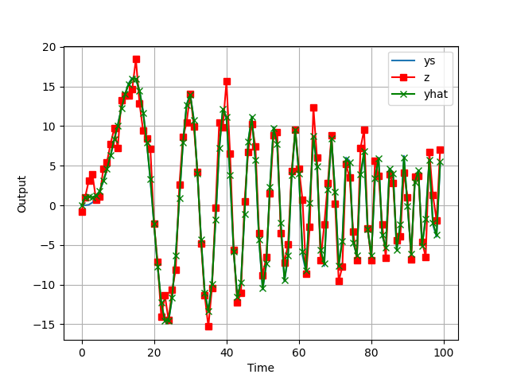

# Kalman Filter (Dec 2025)

A discrete Kalman filter was implemented to improve state estimation for a Remotely Operated Vehicle (ROV). The system model provides a more reliable prediction of the vehicle’s dynamics than raw sensor measurements, allowing the filter to fuse both sources and produce a smoother, more accurate estimate of the true system state.

---

## Overview
- Modeled ROV dynamics and implemented a discrete Kalman filter for state estimation  
- Combined model‑based predictions with noisy sensor measurements to reduce variance and improve accuracy  
- Demonstrated improved tracking performance and noise rejection compared to raw sensor data  

---

## Output Visualization

**Figure Explanation:**  
- **ys** — ground‑truth system output used as the reference  
- **z** — noisy sensor measurement affected by disturbances and sensor limitations  
- **yhat** — Kalman filter estimate, combining model predictions with measurements to produce a smooth, reliable approximation of the true output  

---

## Technical Details

### State‑Space Model
The ROV dynamics were represented using a discrete state‑space formulation with:
- A system state vector  
- Control inputs  
- Noisy sensor measurements  
- Process noise representing model uncertainty  
- Measurement noise representing sensor variance  

### Filter Structure
The filter operated in two stages:
1. **Prediction:**  
   - Propagated the previous state estimate through the system model  
   - Updated the estimate uncertainty based on assumed process noise  

2. **Update:**  
   - Compared predicted measurements to actual sensor readings  
   - Computed a correction term (Kalman gain)  
   - Updated the state estimate and reduced uncertainty  

### Noise Modeling
- **Process noise:** tuned to reflect unmodeled dynamics  
- **Measurement noise:** derived from sensor variance during static tests  
- **Initial covariance:** set large to allow rapid convergence during early steps  

### Implementation Notes
- Implemented in Python using NumPy for matrix operations  
- Simulation included injected Gaussian noise to emulate real sensor behavior  
- Performance evaluated by comparing error between raw measurements and filtered estimates  
